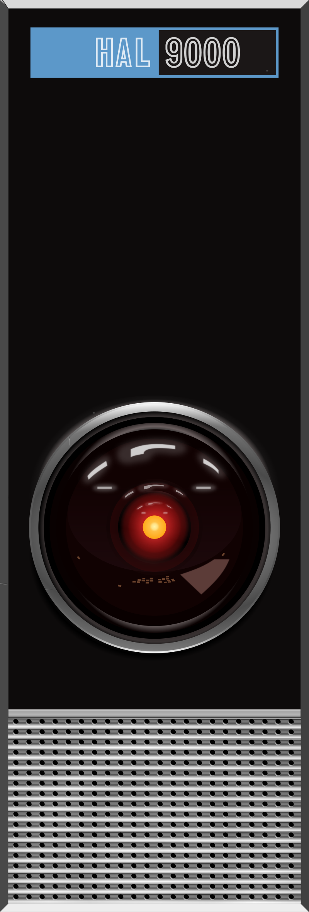

# HAL 9000 - System Interface

A retro computer interface inspired by HAL 9000 from "2001: A Space Odyssey" for interacting with Amazon Q CLI and executing shell commands.



## 🚀 Quick Start

### Download & Install
```bash
# Download the latest release
wget https://gitlab.com/your-username/hal9000-interface/-/raw/main/hal9000-interface-2.0.tar.gz

# Extract and install
tar -xzf hal9000-interface-2.0.tar.gz
cd hal9000-interface-2.0
./install.sh

# Launch HAL
hal9000
```

### Or Run from Source
```bash
git clone https://gitlab.com/your-username/hal9000-interface.git
cd hal9000-interface
python3 hal_gui.py
```

## ✨ Features

- **🎨 Dual Color Themes**: Toggle between classic green and retro amber terminal colors
- **🖥️ IBM Terminal Fonts**: Authentic monospace fonts for professional appearance
- **🤖 Q CLI Integration**: Direct interaction with Amazon Q for AWS assistance
- **💻 Shell Mode**: Execute bash commands with real-time output and tab completion
- **🪟 WSL Support**: Seamless Windows Subsystem for Linux integration on Windows
- **🎯 Tab Completion**: File and directory completion just like a real shell
- **📊 HAL Aesthetic**: Authentic HAL 9000 panel image and retro styling
- **💾 Conversation Logging**: Save and export your interactions
- **🔄 Mode Switching**: Seamlessly switch between Q CLI and shell modes

## 🎨 Interface Modes

### Q CLI Mode
- Direct integration with Amazon Q CLI
- AWS expertise and assistance
- Green/amber terminal styling
- Real-time responses

### Shell Mode  
- Full bash command execution
- Tab completion for files/directories
- Working directory tracking
- Real-time output display
- Color-coded command/output/errors
- **WSL Integration**: Automatic Windows Subsystem for Linux support

## 🪟 Windows WSL Integration

HAL automatically detects and integrates with WSL on Windows systems:

- **Automatic Detection**: Detects WSL availability on startup
- **Seamless Integration**: Shell commands run in WSL environment
- **Q CLI Support**: Amazon Q CLI runs in WSL for better compatibility
- **File Completion**: Tab completion works with WSL filesystem
- **Path Handling**: Automatic path conversion between Windows and WSL

**See [Windows WSL Guide](WINDOWS_WSL_GUIDE.md) for detailed setup instructions.**

## 🎯 Color Themes

### Green Theme (Classic)
- **Terminal**: Bright green text on black
- **Shell**: Cyan commands, white output
- **System**: Yellow messages
- **Nostalgic**: 1980s computer aesthetic

### Amber Theme (Vintage)
- **Terminal**: Warm amber text on black  
- **Shell**: Light amber commands, amber output
- **System**: Orange messages
- **Professional**: IBM mainframe look

## 🛠️ Requirements

- Python 3.6 or higher
- tkinter (usually included with Python)
- Amazon Q CLI (for Q mode functionality)
- Optional: PIL/Pillow (for HAL panel image)

## 📦 Installation Options

### Automated Installer (Recommended)
```bash
./install.sh
```
- Checks all dependencies
- Installs missing packages
- Creates desktop shortcuts
- Sets up PATH integration

### Manual Installation
```bash
pip install -r requirements.txt
python3 hal_gui.py
```

### Troubleshooting
```bash
# Run diagnostic script
./test_hal.sh

# Test PIL/ImageTk issues
python3 test_pil.py

# Use PIL-free version
python3 hal_gui_no_pil.py
```

## 🎮 Usage

### Basic Operation
1. **Launch HAL** using any installation method
2. **Choose Mode**: Click Q CLI or SHELL buttons
3. **Toggle Theme**: Click AMBER/GREEN button for color themes
4. **Type Commands**: Use input field for queries or shell commands
5. **Tab Complete**: Press Tab in shell mode for file completion

### Shell Mode Examples
```bash
ls -la                    # List files
pwd                       # Current directory  
cd Documents             # Change directory (tracked)
echo "Hello HAL"         # Simple commands
df -h                    # System information
ps aux | grep python     # Pipes and filters
```

### Q CLI Mode Examples
```
How do I create an S3 bucket?
What's the best EC2 instance type for web servers?
Show me AWS CLI commands for Lambda functions
```

## 🔧 Development

### Project Structure
```
hal9000-interface/
├── assets/                    # HAL panel image and resources
├── hal_gui.py                # Main GUI (with PIL support)
├── hal_gui_no_pil.py         # PIL-free version
├── hal_debug.py              # Debug/testing version
├── install.sh                # Automated installer
├── launch_hal.sh             # Direct launcher
├── test_hal.sh               # Troubleshooting script
├── test_pil.py               # PIL diagnostic tool
├── requirements.txt          # Python dependencies
├── Makefile                  # Build automation
├── SHELL_MODE_GUIDE.md       # Shell usage documentation
└── hal9000-interface-2.0.tar.gz  # Distribution package
```

### Building from Source
```bash
# Clean previous builds
make clean

# Create distribution package
make package

# Install locally
make install
```

### Contributing
1. Fork the repository
2. Create a feature branch
3. Make your changes
4. Test thoroughly
5. Submit a merge request

## 📄 License

This project is licensed under the GNU General Public License v3.0 (GPLv3).
See the [LICENSE](LICENSE) file for details.

### HAL 9000 Panel Image License

The HAL 9000 panel image is used under CC BY-SA 4.0 license:

**Attribution**: By [Tom Cowap](https://commons.wikimedia.org/w/index.php?title=User:Tom_Cowap&action=edit&redlink=1) - Own work, [CC BY-SA 4.0](https://creativecommons.org/licenses/by-sa/4.0), [Link](https://commons.wikimedia.org/w/index.php?curid=103068276)

## 🐛 Issues & Support

- **Bug Reports**: Use GitLab Issues
- **Feature Requests**: Use GitLab Issues with enhancement label
- **Documentation**: Check SHELL_MODE_GUIDE.md and QUICKSTART.md
- **Troubleshooting**: Run `./test_hal.sh` for diagnostics

## 🎬 Inspiration

*"I'm sorry, Dave. I'm afraid I can't do that."* - HAL 9000

But this HAL **can** help you with AWS operations and system administration! 🚀

## 📊 Screenshots

### Green Theme


### Amber Theme  


### Shell Mode


---

**Made with ❤️ for retro computing enthusiasts and AWS professionals**
